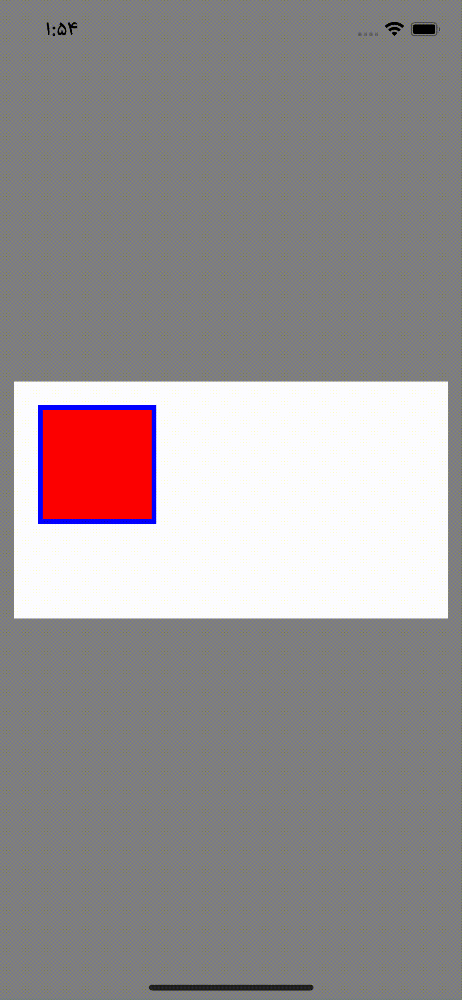
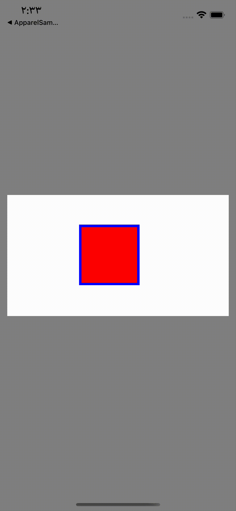
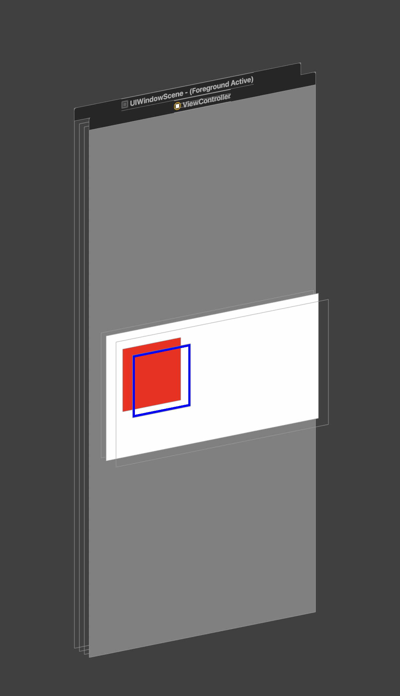
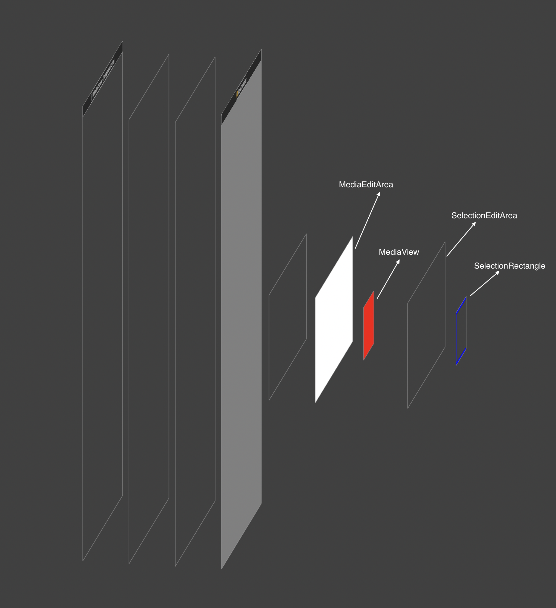

# MediaSelectionBorderTest

Simulate what web Editor has for handling media out side the editing area;

The idea is to have an Editing area which clips the media but not it's border, so if media goes outside the EditingArea,
it's border still visible and can be selected and move back into editing area;

 

### The structure of the views is as below:

* The `SelectionRectangle` is a separate view;
* The `MediaView` is a separate view;
* `SelectionRectangle` and `MediaView` connect together via `delegate` (`listener`);
* All the gestures (tap, move, scale ...) goes through `SelectionRectangle` and it will decides when to pass this events to `MediaView`;
* The screen contains two main view, one is `MediaEditArea` (which holds `MediaView`) and another is `SelectionEditArea` (which holds `SelectionRectangle`);
* `MediaEditArea` clips all of it's subView (`clipToBounds = true`);
* `SelectionEditArea` does not clip any of it's subView (`clipToBounds = false`);
* `SelectionEditArea` has a clear background color;

